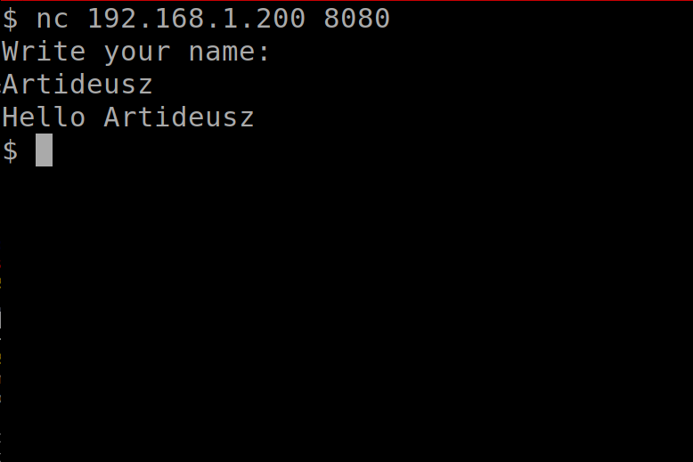
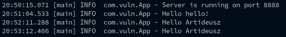

# A Log4Shell Vulnerable Java App

This is a simple Java application where users can research and test the `CVE-2021-44228` vulnerability.

## Requirements
- Maven
- **Java version `8u121` or older**

## How to run on **system**
1. Run `mvn clean compile assembly:single`.
2. Run `java -cp target/vulnerable_app-0.0.1-jar-with-dependencies.jar com.vuln.App <port>`
3. Done.

## How to run on **Docker**
1. Run `docker run -it -p <port>:8888 artideusz/vulnerables_log4shell_java_app`
2. Done.

## What does the app do?
The application is a simple TCP server that asks the user their name, and then echoes back to them. The content is also logged to the console on the server.

*Connection to the server via netcat.*

*Log4j Server Output after sending data via netcat.*

   
